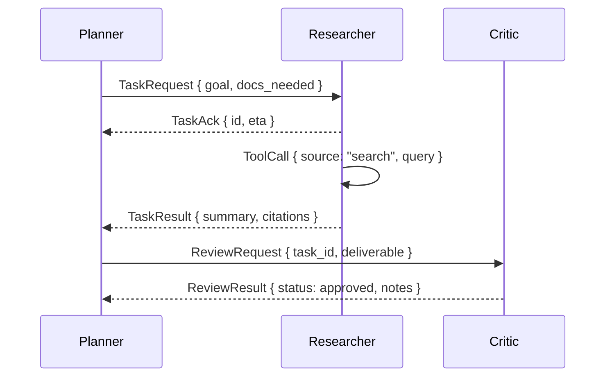

# Agent Communication Protocols

⏱️ **Estimated reading time: 12 minutes**

Tags: #modern-frameworks #communication #protocols #multi-agent #tooling #integration

## Introduction

As agentic systems scale to multiple autonomous collaborators, consistent communication becomes critical. Well-defined protocols ensure that agents exchange context, intents, and artifacts safely and efficiently. This guide surveys modern approaches to agent messaging and highlights implementation strategies for production systems.

## Communication Goals

1. **Shared Understanding** – guarantee that intents, data schemas, and results are unambiguous.
2. **Reliability** – handle retries, acknowledgements, and message ordering.
3. **Security** – authenticate agents, enforce permissions, and redact sensitive data.
4. **Observability** – trace messages for debugging and compliance.

## Common Communication Patterns

| Pattern | Description | When to Use |
|---------|-------------|-------------|
| **Request/Response** | Synchronous RPC between agents | Tool invocation, quick lookups |
| **Event Streams** | Publish/subscribe topics for state changes | Monitoring, triggers, fan-out |
| **Blackboard** | Shared workspace read/write | Collaborative planning, shared drafts |
| **Conversation Threads** | Human-like dialogues with roles | Brainstorming, negotiation |
| **Workflow Graph** | Directed acyclic graph of tasks | Deterministic orchestration |

## Modern Protocols & Standards

### Model Context Protocol (MCP)
- **Purpose**: Standard interface for LLM-to-tool communication.
- **Features**: Structured tool schemas, secure transport, event subscriptions.
- **Best For**: Integrating external APIs or enterprise systems with agents.

### OpenAI Realtime & Function Calls
- **Purpose**: Streaming interactions with tool calling support.
- **Features**: JSON schemas, partial responses, server events.
- **Best For**: Interactive experiences, voice agents, low-latency responses.

### LangGraph Channels
- **Purpose**: Typed messaging between nodes in a graph.
- **Features**: Declarative routing, state snapshots, deterministic replays.
- **Best For**: Regulated industries requiring auditability.

### gRPC / REST Gateways
- **Purpose**: Traditional service APIs for agent services.
- **Features**: Strong typing, auth controls, language-agnostic.
- **Best For**: Cross-team integration, polyglot environments.

## Designing a Communication Contract

1. **Define message schemas** using JSON Schema or Protocol Buffers.
2. **Specify roles** (sender, receiver, observers) and authorization scopes.
3. **Capture metadata**: timestamps, correlation IDs, confidence scores, cost tokens.
4. **Model lifecycle**: pending → in-progress → completed → failed.
5. **Plan fallbacks**: retries, escalations, or human review.

## Implementation Tips

- **Schema Validation**: Use Pydantic or JSON Schema validators before processing messages.
- **Idempotency Keys**: Ensure retried messages do not trigger duplicate work.
- **Priority Queues**: Route urgent tasks ahead of background jobs.
- **Rate Limits**: Throttle internal traffic to protect shared resources.
- **Encryption**: Secure payloads at rest (KMS) and in transit (TLS).

## Monitoring & Observability

- **Tracing**: Propagate trace IDs across agents (OpenTelemetry).
- **Logging**: Store structured logs with role, action, outcome.
- **Metrics**: Track queue depth, message latency, success rate.
- **Alerting**: Notify on stuck messages, error spikes, or policy violations.

## Testing Communication Flows

1. **Unit tests** for schema compliance and serializer/deserializer logic.
2. **Integration tests** for end-to-end message lifecycles.
3. **Chaos tests**: introduce dropped messages or delays to validate resilience.
4. **Security tests**: attempt unauthorized actions to verify access controls.

## Next Steps

- Implement shared vocabulary with [`agentic-ai-schema`](https://github.com) or internal schema registry.
- Explore [Modern Multi-Agent Systems](multi_agent_systems.md) for orchestration patterns.
- Integrate [Security & Observability](security_observability.md) practices to complete the communication stack.

---

*Robust communication protocols turn collections of agents into coordinated teams. Invest early in contracts, tooling, and monitoring to keep multi-agent systems reliable and trustworthy.*