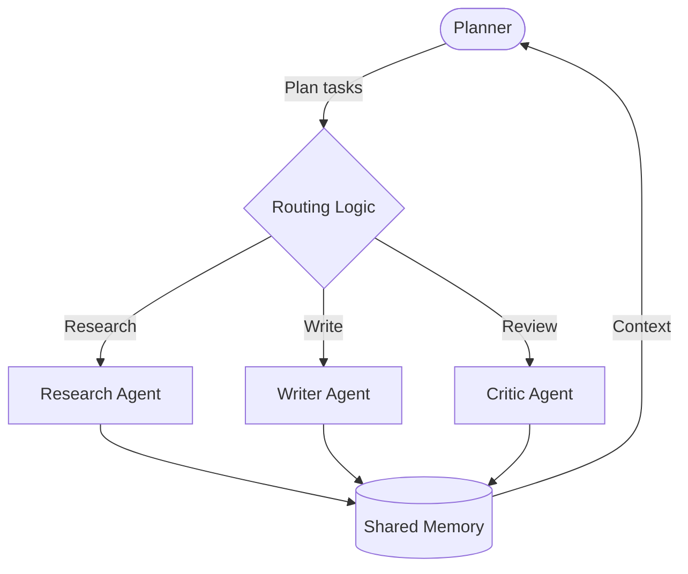

# Modern Multi-Agent Systems

⏱️ **Estimated reading time: 15 minutes**

Tags: #modern-frameworks #multi-agent #coordination #autonomous-systems #orchestration #advanced

## Overview

Multi-agent systems (MAS) extend single-agent architectures by combining multiple specialized agents that collaborate to solve complex problems. Modern MAS frameworks deliver shared memory, orchestrated tool use, and coordination primitives that let builders design sophisticated workflows with resilience and transparency.

## Why Multi-Agent Architectures Matter

- **Specialization**: Different agents focus on planning, reasoning, execution, or validation, mirroring cross-functional teams.
- **Parallelism**: Tasks can be processed concurrently, reducing latency for complex jobs.
- **Fault tolerance**: When agents communicate through managed state, failed steps can be retried or reallocated.
- **Explainability**: Role-based agents produce clearer traces than monolithic prompts.

## Core Design Patterns

1. **Coordinator / Worker**
   - A central coordinator assigns work to specialized workers.
   - Useful for retrieval-augmented generation, data enrichment, or customer support flows.

2. **Planner / Executor**
   - A planner agent decomposes goals while an executor interacts with tools.
   - Works well for long-horizon tasks (e.g., research, content creation).

3. **Critic / Actor**
   - Actor proposes solutions; critic reviews and requests refinements.
   - Inspired by reinforcement learning, popular for safety-sensitive domains.

4. **Delegator / Delegate Teams**
   - Delegator spins up new agents dynamically based on context.
   - Supports elastic scaling with frameworks like OpenAI Swarm or CrewAI.

## Key Frameworks

| Framework | Strengths | Notable Features |
|-----------|-----------|------------------|
| **OpenAI Swarm** | Lightweight role orchestration | Dynamic agent spawning, shared context, message handlers |
| **CrewAI** | Role-based collaboration | Task graphs, embedded memory, custom tools |
| **Lindy** | Enterprise automation | Prebuilt business flows, integration connectors |
| **AutoGen** | Multi-agent LLM dialogues | Conversational protocols, human-in-the-loop |
| **HiveMind (LangGraph)** | Graph-based orchestration | Deterministic routing, persistent state, error recovery |

## Architectural Considerations

- **State Sharing**: Decide between centralized memory (vector DB, Redis) or peer-to-peer message passing.
- **Coordination Logic**: Use deterministic graphs for audit trails or event-driven queues for flexibility.
- **Tool Governance**: Restrict high-risk tools to specific agents; log every invocation.
- **Scaling Strategy**: Support horizontal scaling using serverless workers or containerized agents.

## Building with LangGraph & Swarm

1. **Planner** decomposes user goals into structured tasks.
2. **Router** selects the best agent using metadata (skills, load, priority).
3. **Agents** operate on shared memory and toolkits (browsers, code, APIs).
4. **Critic** enforces quality and triggers revisions before final response.

## Implementation Tips

- **Define clear roles** with explicit capabilities and tool access.
- **Capture conversation state** so agents can recover from interruptions.
- **Instrument tracing** (e.g., LangSmith, Honeycomb) to debug multi-agent flows.
- **Measure outcomes** per agent to iteratively improve prompts and logic.

## When to Use MAS

| Situation | Recommendation |
|-----------|----------------|
| Complex workflows with many steps | ✅ Use MAS for modularity |
| Simple question answering | ❌ Single agent is simpler |
| High-stakes decisions | ✅ Pair actor with reviewer |
| Heavy tool usage | ✅ Separate tool-calling agent for governance |
| Low latency chatbots | ❌ Extra agents add overhead |

## Action Plan

1. Map the user journey and identify specialized roles.
2. Choose an orchestration framework aligned with your deployment stack.
3. Prototype the minimum viable agent team in a sandbox.
4. Add monitoring, observability, and automated tests.
5. Iterate on prompts, routing logic, and fallbacks using real telemetry.

---

*Next: Explore [Agent Communication Protocols](communication_protocols.md) to design robust messaging strategies between agents.*