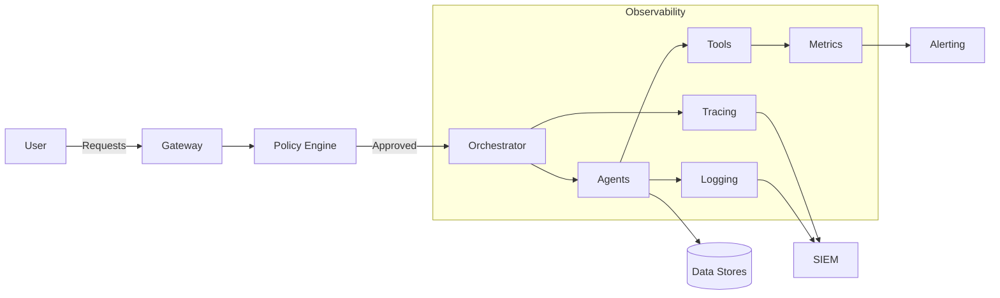

# Security & Observability for Agentic Systems

⏱️ **Estimated reading time: 14 minutes**

Tags: #modern-frameworks #security #observability #governance #compliance #monitoring #risk

## Why Security & Observability Matter

Agentic systems interact with sensitive data, execute autonomous workflows, and call external tools. Without rigorous security and observability, they can exfiltrate data, incur runaway costs, or produce harmful outputs. This guide outlines guardrails, telemetry, and governance practices for production-grade deployments.

## Security Pillars

1. **Identity & Access Management (IAM)**
   - Assign unique identities per agent role.
   - Use least-privilege permissions for APIs, databases, and tools.
   - Rotate credentials automatically and store them in secure vaults.

2. **Policy Enforcement**
   - Define allow/deny lists for API calls and tool usage.
   - Implement content filters (toxicity, PII) before output delivery.
   - Require human approval for high-impact actions (financial trades, code deploys).

3. **Data Protection**
   - Encrypt inputs/outputs at rest and in transit.
   - Redact sensitive fields before sending to third-party models.
   - Maintain audit trails for compliance (GDPR, HIPAA, SOC2).

4. **Runtime Safety**
   - Sandbox execution environments for code tools.
   - Limit CPU, memory, and network egress.
   - Terminate sessions on anomalous behavior.

## Observability Stack

| Layer | Telemetry | Tools |
|-------|-----------|-------|
| **Tracing** | Step-by-step execution, tool calls | LangSmith, OpenTelemetry, Honeycomb |
| **Logging** | Structured events with metadata | Vector, Datadog, ELK Stack |
| **Metrics** | Latency, cost, success rates | Prometheus, CloudWatch, Grafana |
| **Events** | Alerts, anomalies, policy violations | PagerDuty, Opsgenie |

### Tracing Best Practices
- Assign a correlation ID per user request.
- Record prompts, responses, tool parameters (with redaction).
- Capture retries, fallbacks, and error messages.
- Visualize the agent graph to identify bottlenecks.

### Logging Best Practices
- Use JSON logs with fields: `timestamp`, `agent_role`, `action`, `resource`, `outcome`, `confidence`.
- Separate PII from general logs; store secure versions with restricted access.
- Sample high-volume logs while preserving error cases.

### Metrics to Watch
- **Task success rate** and failure reasons.
- **Token usage** and cost per workflow.
- **Tool invocation latency** and error counts.
- **Safety filter hits** and escalations.

## Governance Controls

1. **Change Management**
   - Version prompts, tool definitions, and agent graphs.
   - Require peer review for modifications.

2. **Incident Response**
   - Define runbooks for outages or unsafe behavior.
   - Automate containment (disable agent, revoke keys).

3. **Compliance Reporting**
   - Map telemetry to regulatory controls.
   - Generate monthly evidence packs (activity logs, access reviews).

4. **Human Oversight**
   - Provide dashboards for analysts to monitor live sessions.
   - Allow humans to intervene, edit outputs, or pause executions.

## Reference Architecture

## Implementation Checklist

- [ ] Adopt centralized secrets management (HashiCorp Vault, AWS Secrets Manager).
- [ ] Enforce TLS for all internal and external traffic.
- [ ] Implement OpenTelemetry tracing with correlation IDs.
- [ ] Stream logs to a SIEM with automated alerting.
- [ ] Define incident severity levels and response playbooks.
- [ ] Simulate adversarial prompts to validate guardrails.
- [ ] Review access controls quarterly.

## Tooling Landscape

| Category | Tools & Services |
|----------|------------------|
| **Secrets** | HashiCorp Vault, AWS Secrets Manager, Azure Key Vault |
| **Tracing** | LangSmith, OpenTelemetry, Datadog APM |
| **Policy** | Open Policy Agent (OPA), Aserto, Permit.io |
| **Safety** | Guardrails AI, Rebuff, NeMo Guardrails |
| **Monitoring** | Prometheus, Grafana, CloudWatch, New Relic |
| **SIEM** | Splunk, Sumo Logic, Panther |

## Bringing It All Together

1. **Baseline**: instrument every agent action and tool call.
2. **Secure**: lock down secrets, networks, and workloads.
3. **Automate**: enforce policies and respond to incidents programmatically.
4. **Iterate**: use telemetry to improve prompts, tooling, and governance.

---

*Continue exploring the Modern AI Frameworks track with [Enterprise Platforms](enterprise-platforms.md) or revisit [Agent Communication Protocols](communication-protocols.md) to refine message handling policies.*