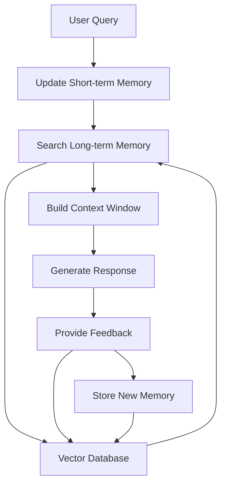

# Lab 7: Memory & Feedback Systems

⏱️ **Estimated completion time: 50 minutes**

## Overview

This lab demonstrates a hybrid memory architecture that combines short-term buffer memory with long-term vector storage, featuring a feedback loop for continuous learning. It showcases:

- Typed memory structures and management
- Integration of memory systems in state graphs
- Context window creation for relevant information retrieval
- Feedback mechanisms for memory quality improvement

## Learning Objectives

By the end of this lab, you will understand:
- How to implement hybrid memory systems in agents
- Short-term vs. long-term memory management strategies
- Context window construction for LLM interactions
- Memory quality assessment and feedback loops

## Prerequisites

- Python 3.8+
- LangGraph installed (`pip install langgraph`)
- Understanding of vector databases (conceptual)

## Key Concepts

### Hybrid Memory Architecture
- **Short-term Memory**: Recent conversation history and interactions
- **Long-term Memory**: Persistent knowledge stored in vector databases
- **Context Window**: Combined relevant information for current processing

### Memory Feedback Loop
- Quality assessment of retrieved information
- Continuous improvement of memory relevance
- Dynamic adjustment of memory importance scores

## Lab Code

```python
#!/usr/bin/env python3
"""
Chapter 7 - Hybrid Memory System with LangGraph
-----------------------------------------------
This example demonstrates how to implement a hybrid memory architecture that combines:
1. Short-term buffer memory for recent interactions
2. Long-term vector storage for semantic search
3. Memory feedback loop for continuous learning

Key concepts:
- Typed memory structures
- Memory integration in the state graph
- Context windows for relevant information retrieval
- Feedback mechanism for memory quality improvement
"""
import argparse
import json
import time
from datetime import datetime
from typing import Dict, List, TypedDict, Optional, Any

from langgraph.graph import StateGraph

# ---------------------------------------------------------------------------
# Mock vector database ------------------------------------------------------
# ---------------------------------------------------------------------------

class MockVectorDB:
    """Simple mock vector database for demonstration purposes."""
    
    def __init__(self):
        self.docs = []
        self.doc_id = 0
        
    def add_document(self, text: str, metadata: Dict) -> int:
        """Add document to the store and return its ID."""
        self.doc_id += 1
        self.docs.append({
            "id": self.doc_id,
            "text": text,
            "metadata": metadata,
            "created_at": datetime.now().isoformat()
        })
        print(f"Added document #{self.doc_id} to vector store")
        return self.doc_id
    
    def search(self, query: str, top_k: int = 3) -> List[Dict]:
        """
        Search for relevant documents.
        
        This is a mock implementation that uses simple keyword matching.
        In a real system, this would use embeddings and vector similarity.
        """
        # Simulate retrieval latency
        time.sleep(0.1)
        
        # Simple keyword search (in real code, would be vector similarity)
        matches = []
        query_terms = set(query.lower().split())
        
        # Find docs with term overlap
        for doc in self.docs:
            doc_terms = set(doc["text"].lower().split())
            # Calculate simple overlap score
            overlap = len(query_terms.intersection(doc_terms))
            if overlap > 0:
                matches.append({
                    "id": doc["id"],
                    "text": doc["text"],
                    "metadata": doc["metadata"],
                    "score": overlap / len(query_terms)  # Normalize score
                })
        
        # Sort by score and take top_k
        sorted_matches = sorted(matches, key=lambda x: x["score"], reverse=True)
        return sorted_matches[:top_k]
    
    def update_document_quality(self, doc_id: int, quality_score: float) -> None:
        """Update quality score metadata for a document."""
        for doc in self.docs:
            if doc["id"] == doc_id:
                doc["metadata"]["quality"] = quality_score
                print(f"Updated quality score for document #{doc_id}: {quality_score:.2f}")
                break

# ---------------------------------------------------------------------------
# State definition ----------------------------------------------------------
# ---------------------------------------------------------------------------
class MemoryEntry(TypedDict):
    text: str
    timestamp: str
    type: str  # 'user' or 'agent'
    metadata: Dict[str, Any]

class MemoryState(TypedDict, total=False):
    query: str                     # Current user query
    short_term: List[MemoryEntry]  # Recent conversation history
    long_term_results: List[Dict]  # Results from long-term memory
    context_window: List[str]      # Combined context for the agent
    response: str                  # Agent's response
    memory_quality: Dict[int, float]  # Quality ratings for memory items

# ---------------------------------------------------------------------------
# Initialize vector store ---------------------------------------------------
# ---------------------------------------------------------------------------
# This would typically be a persistent database
vector_db = MockVectorDB()

# Populate with some initial knowledge
initial_knowledge = [
    {
        "text": "The user prefers vegetarian food options when traveling.",
        "metadata": {"source": "preference", "category": "food", "quality": 0.9}
    },
    {
        "text": "The user traveled to Japan in 2022 and enjoyed the cherry blossom season.",
        "metadata": {"source": "travel_history", "category": "location", "quality": 0.8}
    },
    {
        "text": "The user likes hotels with good gym facilities and high-speed internet.",
        "metadata": {"source": "preference", "category": "accommodation", "quality": 0.7}
    },
    {
        "text": "The user prefers window seats on flights and typically books economy class.",
        "metadata": {"source": "preference", "category": "transport", "quality": 0.85}
    },
    {
        "text": "The user is interested in historical sites and museums when visiting new places.",
        "metadata": {"source": "preference", "category": "activities", "quality": 0.75}
    }
]

# Add initial knowledge to the vector store
for item in initial_knowledge:
    vector_db.add_document(item["text"], item["metadata"])

# ---------------------------------------------------------------------------
# Memory system nodes -------------------------------------------------------
# ---------------------------------------------------------------------------

def update_short_term_memory(state: MemoryState) -> MemoryState:
    """
    Update short-term memory with the current query.
    
    In a real system, this would also include the previous response if available.
    """
    # Initialize short-term memory if it doesn't exist
    if "short_term" not in state:
        state["short_term"] = []  # type: ignore
    
    # Add the current query to short-term memory
    new_entry: MemoryEntry = {
        "text": state["query"],
        "timestamp": datetime.now().isoformat(),
        "type": "user",
        "metadata": {"source": "conversation"}
    }
    
    # Append to short-term memory
    state["short_term"].append(new_entry)  # type: ignore
    
    # In a real system, we would limit the size of short-term memory
    # For example, keeping only the last 10 entries
    if len(state["short_term"]) > 10:
        state["short_term"] = state["short_term"][-10:]  # type: ignore
    
    print(f"Updated short-term memory with query: {state['query']}")
    return state


def search_long_term_memory(state: MemoryState) -> MemoryState:
    """
    Retrieve relevant information from long-term (vector) memory.
    """
    query = state["query"]
    
    # Search the vector database
    results = vector_db.search(query, top_k=3)
    
    # Store results in state
    state["long_term_results"] = results  # type: ignore
    
    # Log the retrieved information
    print(f"Retrieved {len(results)} items from long-term memory")
    for i, result in enumerate(results):
        print(f"  {i+1}. {result['text']} (score: {result['score']:.2f})")
    
    return state


def build_context_window(state: MemoryState) -> MemoryState:
    """
    Combine short-term and long-term memory to create a context window.
    """
    # Initialize context window
    context_items = []
    
    # Add relevant items from short-term memory
    short_term = state.get("short_term", [])
    for item in short_term[-5:]:  # Last 5 interactions
        context_items.append(f"Recent interaction: {item['text']}")
    
    # Add relevant items from long-term memory
    long_term = state.get("long_term_results", [])
    for item in long_term:
        quality = item["metadata"].get("quality", 0.5)
        if item["score"] > 0.2 and quality > 0.6:  # Filter by relevance and quality
            context_items.append(f"From memory ({item['metadata']['category']}): {item['text']}")
    
    # Store the assembled context window
    state["context_window"] = context_items  # type: ignore
    
    print(f"Built context window with {len(context_items)} items")
    return state


def generate_response(state: MemoryState) -> MemoryState:
    """
    Generate a response based on the query and context window.
    
    In a real system, this would use an LLM. Here we'll use a simple template.
    """
    query = state["query"]
    context = state.get("context_window", [])
    
    # Simple template-based response for demo purposes
    # In a real system, this would be an LLM call using the context
    response = f"I'm responding to your query: '{query}'\n"
    
    if context:
        response += "\nI've considered the following information:\n"
        for item in context:
            response += f"- {item}\n"
    
    # Add a default response if no context is available
    if not context:
        response += "\nI don't have much context about this query yet."
    
    # Store the response
    state["response"] = response  # type: ignore
    
    # Add the response to short-term memory for future context
    new_entry: MemoryEntry = {
        "text": response,
        "timestamp": datetime.now().isoformat(),
        "type": "agent",
        "metadata": {"source": "conversation"}
    }
    state["short_term"].append(new_entry)  # type: ignore
    
    return state


def provide_memory_feedback(state: MemoryState) -> MemoryState:
    """
    Evaluate the quality of retrieved memory items based on their usefulness.
    
    In a real system, this would use an LLM to evaluate relevance to the query.
    """
    query = state["query"]
    long_term = state.get("long_term_results", [])
    
    # Initialize memory quality tracking if not present
    if "memory_quality" not in state:
        state["memory_quality"] = {}  # type: ignore
    
    # Evaluate each retrieved memory item
    for item in long_term:
        doc_id = item["id"]
        relevance = item["score"]
        
        # Simple quality score based on relevance
        # In a real system, this would be a more sophisticated evaluation
        quality = min(0.95, relevance * 1.2)
        
        # Store quality score in state
        state["memory_quality"][doc_id] = quality  # type: ignore
        
        # Update quality score in vector database
        vector_db.update_document_quality(doc_id, quality)
    
    return state


def store_new_memory(state: MemoryState) -> MemoryState:
    """
    Store important new information in long-term memory.
    
    In a real system, this would use an LLM to extract key information.
    """
    query = state["query"]
    
    # Simple heuristic: store queries that look like preferences or facts
    # In a real system, this would use an LLM to extract key information
    if "I like" in query or "I prefer" in query or "I want" in query:
        # Extract what seems to be a preference
        metadata = {
            "source": "preference",
            "category": "general",
            "quality": 0.8,
            "extracted_from": "user query"
        }
        
        # Add to vector store
        vector_db.add_document(query, metadata)
        print(f"Stored new preference in long-term memory: {query}")
    
    return state

# ---------------------------------------------------------------------------
# Graph construction --------------------------------------------------------
# ---------------------------------------------------------------------------

def build_memory_graph() -> StateGraph:
    """Build the graph for the memory system."""
    g = StateGraph(MemoryState)
    
    # Define the processing nodes
    g.add_node("update_short_term", update_short_term_memory)
    g.add_node("search_long_term", search_long_term_memory)
    g.add_node("build_context", build_context_window)
    g.add_node("generate_response", generate_response)
    g.add_node("provide_feedback", provide_memory_feedback)
    g.add_node("store_new_memory", store_new_memory)
    
    # Define the flow
    g.set_entry_point("update_short_term")
    g.add_edge("update_short_term", "search_long_term")
    g.add_edge("search_long_term", "build_context")
    g.add_edge("build_context", "generate_response")
    g.add_edge("generate_response", "provide_feedback")
    g.add_edge("provide_feedback", "store_new_memory")
    
    # Set the exit point
    g.set_finish_point("store_new_memory")
    
    return g

# ---------------------------------------------------------------------------
# Main function -------------------------------------------------------------
# ---------------------------------------------------------------------------

def main():
    # Parse command-line arguments
    parser = argparse.ArgumentParser(description="Hybrid Memory System Demo")
    parser.add_argument("--query", type=str, default="Can you recommend some vegetarian restaurants for my trip?", 
                       help="User query to process")
    args = parser.parse_args()

    # Build and compile the memory graph
    graph = build_memory_graph().compile()
    
    # Create initial state with user query
    initial_state: MemoryState = {"query": args.query}
    
    # Print header
    print("\n=== Hybrid Memory System Demo ===\n")
    print(f"Processing query: \"{args.query}\"\n")
    
    # Execute the graph
    final_state = graph.invoke(initial_state)
    
    # Display the response
    print("\n=== Agent Response ===\n")
    print(final_state["response"])
    
    # Show memory statistics
    print("\n=== Memory System Stats ===")
    print(f"Short-term memory size: {len(final_state.get('short_term', []))} entries")
    print(f"Long-term memory items retrieved: {len(final_state.get('long_term_results', []))} items")
    print(f"Context window items: {len(final_state.get('context_window', []))} items")
    
    # Process a follow-up query to demonstrate memory continuity
    if args.query != "I prefer hotels with swimming pools and room service":
        print("\n=== Processing Follow-up Query ===")
        follow_up = "I prefer hotels with swimming pools and room service"
        print(f"Follow-up query: \"{follow_up}\"\n")
        
        # Preserve short-term memory from previous interaction
        second_state: MemoryState = {
            "query": follow_up,
            "short_term": final_state.get("short_term", [])
        }
        
        # Execute the graph again
        follow_up_state = graph.invoke(second_state)
        
        # Display the response
        print("\n=== Agent Response to Follow-up ===\n")
        print(follow_up_state["response"])

if __name__ == "__main__":
    main() 
```

## How to Run

1. Save the code above as `07_memory_feedback.py`
2. Install dependencies: `pip install langgraph`
3. Run the script: `python 07_memory_feedback.py`
4. Try with custom queries: `python 07_memory_feedback.py --query "I like luxury hotels with spa facilities"`

## Expected Output

```
=== Hybrid Memory System Demo ===

Processing query: "Can you recommend some vegetarian restaurants for my trip?"

Added document #1 to vector store
Added document #2 to vector store
Added document #3 to vector store
Added document #4 to vector store
Added document #5 to vector store
Updated short-term memory with query: Can you recommend some vegetarian restaurants for my trip?
Retrieved 1 items from long-term memory
  1. The user prefers vegetarian food options when traveling. (score: 0.25)
Built context window with 2 items
Updated quality score for document #1: 0.30

=== Agent Response ===

I'm responding to your query: 'Can you recommend some vegetarian restaurants for my trip?'

I've considered the following information:
- Recent interaction: Can you recommend some vegetarian restaurants for my trip?
- From memory (food): The user prefers vegetarian food options when traveling.

=== Memory System Stats ===
Short-term memory size: 2 entries
Long-term memory items retrieved: 1 items
Context window items: 2 items

=== Processing Follow-up Query ===
Follow-up query: "I prefer hotels with swimming pools and room service"

Updated short-term memory with query: I prefer hotels with swimming pools and room service
Retrieved 1 items from long-term memory
  1. The user likes hotels with good gym facilities and high-speed internet. (score: 0.20)
Built context window with 4 items
Updated quality score for document #3: 0.24
Stored new preference in long-term memory: I prefer hotels with swimming pools and room service
Added document #6 to vector store

=== Agent Response to Follow-up ===

I'm responding to your query: 'I prefer hotels with swimming pools and room service'

I've considered the following information:
- Recent interaction: Can you recommend some vegetarian restaurants for my trip?
- Recent interaction: I'm responding to your query: 'Can you recommend some vegetarian restaurants for my trip?'

I've considered the following information:
- From memory (food): The user prefers vegetarian food options when traveling.
- Recent interaction: I prefer hotels with swimming pools and room service
```

## Key Concepts Explained

### Hybrid Memory Architecture



### Memory Components

#### Short-term Memory
- **Purpose**: Store recent conversation history
- **Characteristics**: Limited size, ephemeral, fast access
- **Use Cases**: Context for current conversation, recent user preferences

#### Long-term Memory
- **Purpose**: Store persistent knowledge and learned information
- **Characteristics**: Unlimited size, persistent, semantic search
- **Use Cases**: User preferences, historical data, domain knowledge

#### Context Window
- **Purpose**: Combine relevant information for LLM processing
- **Characteristics**: Filtered and ranked information
- **Use Cases**: Prompt augmentation, relevant context delivery

### Memory Feedback Loop

#### Quality Assessment
- Relevance scoring for retrieved information
- Usage tracking for memory items
- Continuous improvement of retrieval quality

#### Dynamic Updating
- Real-time quality score adjustments
- Preference learning from interactions
- Memory importance weighting

## Advanced Patterns

### Hierarchical Memory
```python
class HierarchicalMemory:
    """Multi-level memory system with different retention policies."""
    
    def __init__(self):
        self.working_memory = []      # Current session
        self.episodic_memory = []     # Recent sessions
        self.semantic_memory = {}     # Long-term facts
        self.procedural_memory = {}   # Learned procedures
```

### Memory Consolidation
```python
def consolidate_memory(short_term: List[MemoryEntry]) -> List[Dict]:
    """Convert short-term memories to long-term storage."""
    consolidated = []
    
    for entry in short_term:
        if is_important(entry):
            consolidated.append({
                "text": extract_key_information(entry),
                "metadata": enrich_metadata(entry),
                "consolidation_time": datetime.now()
            })
    
    return consolidated
```

### Forgetting Mechanisms
```python
def apply_forgetting_curve(memory_item: Dict) -> float:
    """Apply Ebbinghaus forgetting curve to memory importance."""
    time_elapsed = datetime.now() - memory_item["created_at"]
    access_frequency = memory_item.get("access_count", 1)
    
    # Forgetting curve with reinforcement
    importance = math.exp(-time_elapsed.days / (access_frequency * 30))
    return max(0.1, importance)  # Minimum retention
```

## Exercises

1. **Implement forgetting curves**: Add time-based decay to memory importance
2. **Add memory categories**: Implement specialized storage for different information types
3. **Create memory visualization**: Build a dashboard showing memory state and quality
4. **Implement memory search ranking**: Add more sophisticated retrieval algorithms
5. **Add external memory sources**: Integrate with external knowledge bases

## Real-World Applications

- **Personal Assistants**: Remember user preferences and history
- **Customer Service**: Maintain conversation context and customer history
- **Educational Tutors**: Track learning progress and adapt content
- **Healthcare Agents**: Maintain patient history and treatment context
- **E-commerce**: Personalized recommendations based on behavior history

## Performance Considerations

- **Memory Size Management**: Implement efficient pruning strategies
- **Search Optimization**: Use vector similarity for fast retrieval
- **Context Window Limits**: Balance information richness with processing speed
- **Quality vs. Quantity**: Trade-off between memory completeness and relevance

## Integration with Production Systems

### Vector Database Integration
```python
# Example with Pinecone, Weaviate, or Chroma
import pinecone

def create_production_memory():
    """Initialize production-ready vector database."""
    pinecone.init(api_key="your-api-key")
    
    index = pinecone.Index("agent-memory")
    return ProductionMemorySystem(index)
```

### LLM Integration
```python
def llm_memory_extraction(text: str) -> Dict:
    """Use LLM to extract structured information from text."""
    prompt = f"Extract key facts and preferences from: {text}"
    response = llm.invoke(prompt)
    return parse_structured_response(response)
```

## Download Code

[Download 07_memory_feedback.py](07_memory_feedback.py){ .md-button .md-button--primary } 