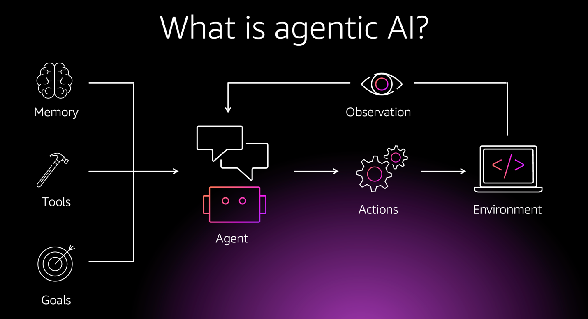

# Introduction to Agentic AI Systems


This course offers a comprehensive exploration of the principles and practices involved in the design, orchestration, and application of advanced agentic AI systems. It delves into core theoretical concepts and illustrates their practical implementation through contemporary software frameworks.

## Course Objectives

This course aims to equip learners with the ability to:
- Understand the fundamental principles and cognitive architectures of agentic artificial intelligence.
- Design robust and sophisticated agent systems capable of complex reasoning and action.
- Develop methodologies for orchestrating multi-step agentic behaviors and managing stateful interactions.
- Integrate diverse capabilities, including external knowledge sources and specialized tools, into agentic frameworks.
- Analyze and apply these concepts to construct and evaluate real-world agentic applications.

## Course Structure

The curriculum is organized into thematic parts, encompassing lessons, practical laboratory exercises, and supplementary appendix materials, fostering a holistic understanding of agentic AI system design.

### Part 1: Foundations of Agentic Intelligence
*Exploring the underpinnings of generative AI and the elemental components of intelligent agents.*

1.  **[Chapter 01: Paradigms of Generative AI & Agentic Systems](Lessons/Chapter01)** (Core Agentic Principles, Foundational Models, Ethical Considerations)
2.  **[Chapter 02: Fundamental Components of Agent Architectures](Lessons/Chapter02)** (Perception, Memory Models, Reasoning Mechanisms, Action Formulation)
3.  **[Chapter 03: Frameworks for Agent Development & Orchestration](Lessons/Chapter03)** (Advanced Component-Based Development, Introduction to Graph-Based State Management for Agents)

### Part 2: Advanced Agent Design and Orchestration Strategies
*Focusing on sophisticated design patterns for agents, including reflective capabilities, tool integration, multi-agent systems, and resilient state management.*

4.  **[Chapter 04: Reflection and Introspection in Agent Cognition](Lessons/Chapter04)** (Self-Correction Paradigms, Metacognitive Loops for Enhanced Performance)
5.  **[Chapter 05: Tool Augmentation & Deliberative Planning in Agents](Lessons/Chapter05)** (Integration of External Utilities, Advanced Planning Algorithms, e.g., ReAct)
6.  **[Chapter 06: Principles of Multi-Agent Systems](Lessons/Chapter06)** (Distributed Agent Architectures, Communication Protocols, Collaborative Task Execution)
7.  **[Chapter 07: Advanced Methodologies for State Persistence & System Resilience](Lessons/Chapter07)** (Sophisticated State Management, Checkpointing Techniques, Fault Tolerance)

### Part 3: Evaluation, Security, and Application of Agentic Systems
*Addressing trustworthy AI, system safety, evaluation methodologies, and the deployment of agentic systems in various domains.*

8.  **[Chapter 08: Constructing Trustworthy and Explainable Agentic Systems](Lessons/Chapter08)** (Explainable AI (XAI) for Agents, Alignment with Human Values, System Transparency)
9.  **[Chapter 09: Ensuring Safety and Ethical Conduct in AI Systems](Lessons/Chapter09)** (Risk Identification and Mitigation, Implementation of Safeguards, Bias and Fairness Considerations)
10. **[Chapter 10: Evaluation and Optimization of Agentic System Performance](Lessons/Chapter10)** (Performance Metrics, Debugging Methodologies, Optimization of Reasoning Pipelines)
11. **[Chapter 11: Real-World Applications & Future Trajectories of Agentic AI](Lessons/Chapter11)** (Domain-Specific Case Studies, Emerging Research Directions)

## Lab Exercises: Practical Application of Agentic AI

The `Labs` directory contains exercises for applying theoretical concepts to practical agentic AI design and implementation. These labs explore topics such as conversational intelligence, stateful interaction management, reflective processing, multi-agent dynamics, and tool-augmented reasoning, primarily utilizing frameworks like **LangChain** and **LangGraph** for illustration. Detailed descriptions are available in [Labs/README.md](Labs/README.md).

## Appendix: Supplementary Materials

The `Appendix` offers detailed guides on specific technologies and concepts:

-   **[Agentic AI Design with LangChain and LangGraph](Appendix/Agentic_AI_Design_Tutorial.md)**: A comprehensive guide on leveraging specific frameworks for building sophisticated AI agents.
-   **[Introduction to DSPy: Programming over Prompting](Appendix/DSPy_Introduction.md)**: An overview of a framework for optimizing LM-driven pipelines.

*(Refer to `Appendix/README.md` for a detailed table of contents.)*

## Getting Started

1.  **Clone Repository**: `git clone https://github.com/memari-majid/Agentic-AI-Systems.git`
2.  **Navigate**: `cd Agentic-AI-Systems`
3.  **Install Dependencies** (Python 3.9+): `pip install -r requirements.txt`
4.  **Set API Keys**: Create a `.env` file in the root directory for necessary API credentials (e.g., for language model access, specific tools, or tracing services).
    ```env
    OPENAI_API_KEY="your_openai_api_key"
    ANTHROPIC_API_KEY="your_anthropic_api_key"
    TAVILY_API_KEY="your_tavily_api_key"
    LANGCHAIN_API_KEY="your_langsmith_api_key"
    LANGCHAIN_TRACING_V2="true"
    LANGCHAIN_PROJECT="AdvancedAgenticAI"
    ```
    **Important**: Add `.env` to your `.gitignore`.
5.  **Explore Lessons**: Commence with `Lessons/Chapter01`.
6.  **Engage with Labs**: E.g., `python Labs/01_hello_graph.py`.

## Prerequisites

-   Proficiency in Python programming.
-   Understanding of fundamental Machine Learning concepts.
-   Basic familiarity with Natural Language Processing (NLP) is advantageous.
-   Access to and foundational knowledge of Large Language Model (LLM) APIs.

## Core Technologies Utilized

This course utilizes several key software frameworks and libraries to illustrate and implement concepts in agentic AI design:
-   **LangChain**: For constructing agent components and foundational application logic.
-   **LangGraph**: For orchestrating complex, stateful agentic interactions and workflows.
-   **LangSmith**: For tracing, debugging, and evaluating agent performance.
-   **DSPy**: For systematic optimization of language model operations within agentic pipelines.
-   LLM SDKs (OpenAI, Anthropic, Vertex AI, etc.): For interfacing with various large language models.
-   Standard Python data science libraries: For auxiliary data manipulation and analysis tasks.

Refer to `requirements.txt` for a comprehensive list of dependencies.

## Contributing

Contributions to enhance this educational resource are highly encouraged. Please open an issue or submit a pull request for any suggestions, corrections, or improvements.

## License

This course material is provided under the [MIT License](LICENSE.txt).

---

We hope you find this course an enriching experience in your exploration of agentic artificial intelligence.


