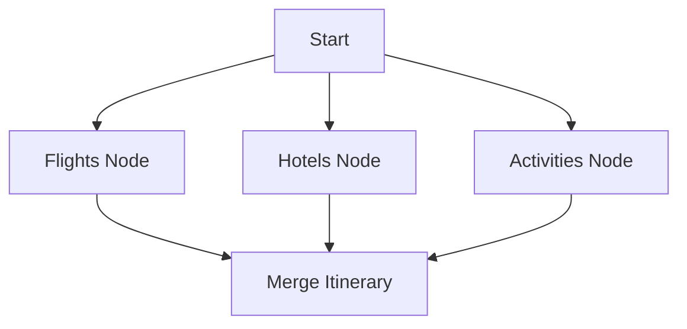

# Lab 5: Parallel Tool Planning

⏱️ **Estimated completion time: 40 minutes**

## Overview

This lab demonstrates a fan-out/fan-in architecture for parallel tool use in a travel planning scenario. It showcases advanced LangGraph patterns including:

- Parallel branch execution for multiple tool calls
- Fan-out/fan-in pattern for reduced latency
- Tool wrapping with retry logic
- State management across parallel operations

## Learning Objectives

By the end of this lab, you will understand:
- How to implement parallel tool execution in LangGraph
- Fan-out/fan-in architectural patterns
- Error handling and retry logic for external API calls
- State aggregation from multiple parallel operations

## Prerequisites

- Python 3.8+
- LangGraph installed (`pip install langgraph`)
- Tenacity for retry logic (`pip install tenacity`)

## Key Concepts

### Fan-out/Fan-in Pattern
- **Fan-out**: Split execution into multiple parallel branches
- **Fan-in**: Merge results from parallel branches into final output
- **Benefits**: Reduced latency, better resource utilization

### Parallel Tool Execution
- Multiple external APIs called simultaneously
- Independent operation execution
- Coordinated result aggregation

## Lab Code

```python
#!/usr/bin/env python3
"""
Chapter 5 - Parallel Tool-Use Planner with LangGraph
---------------------------------------------------
This example demonstrates a fan-out/fan-in architecture for parallel tool use
in a travel planning scenario. It:
1. Searches for flights, hotels, and activities in parallel branches
2. Merges the results into a complete itinerary
3. Handles tool errors with built-in retry logic

Key concepts:
- Parallel branch execution 
- Fan-out/fan-in pattern for reduced latency
- Tool wrapping with retry logic
- Typed state for better maintainability
"""
import argparse
import json
from typing import Dict, List, TypedDict

from tenacity import retry, stop_after_attempt, wait_fixed
from langgraph.graph import StateGraph

# ---------------------------------------------------------------------------
# Mock travel APIs ----------------------------------------------------------
# ---------------------------------------------------------------------------

def _demo_flights(origin: str, destination: str, date: str):
    """Mock flight API - in real life this would call an external service."""
    print(f"🔍 Searching flights: {origin} → {destination} on {date}")
    return [
        {"airline": "BudgetAir", "price": 320, "departure": "07:30", "arrival": "09:45"},
        {"airline": "ComfortJet", "price": 480, "departure": "10:15", "arrival": "12:30"},
        {"airline": "LuxAir", "price": 750, "departure": "13:00", "arrival": "15:15"},
    ]

def _demo_hotels(location: str, check_in: str, check_out: str):
    """Mock hotel API - in real life this would call an external service."""
    print(f"🔍 Searching hotels in {location} from {check_in} to {check_out}")
    return [
        {"name": "City Budget Inn", "price": 120, "rating": 3.5, "amenities": ["WiFi", "Breakfast"]},
        {"name": "Central Hotel", "price": 220, "rating": 4.2, "amenities": ["WiFi", "Pool", "Gym"]},
        {"name": "Luxury Suites", "price": 450, "rating": 4.8, "amenities": ["WiFi", "Pool", "Spa", "Restaurant"]},
    ]

def _demo_activities(location: str, date_range: str):
    """Mock activities API - in real life this would call an external service."""
    print(f"🔍 Searching activities in {location} during {date_range}")
    return [
        {"name": "City Walking Tour", "price": 25, "duration": "2 hours", "rating": 4.5},
        {"name": "Museum Pass", "price": 40, "duration": "All day", "rating": 4.7},
        {"name": "Food & Wine Tour", "price": 85, "duration": "3 hours", "rating": 4.8},
    ]

# ---------------------------------------------------------------------------
# Retry wrappers for API calls ----------------------------------------------
# ---------------------------------------------------------------------------

@retry(stop=stop_after_attempt(3), wait=wait_fixed(1))
def search_flights(origin: str, destination: str, date: str):
    """Wrap flight search with retry logic."""
    return _demo_flights(origin, destination, date)

@retry(stop=stop_after_attempt(3), wait=wait_fixed(1))
def find_hotels(location: str, check_in: str, check_out: str):
    """Wrap hotel search with retry logic."""
    return _demo_hotels(location, check_in, check_out)

@retry(stop=stop_after_attempt(3), wait=wait_fixed(1))
def find_activities(location: str, date_range: str):
    """Wrap activities search with retry logic."""
    return _demo_activities(location, date_range)

# ---------------------------------------------------------------------------
# State typing --------------------------------------------------------------
# ---------------------------------------------------------------------------
class PlannerState(TypedDict, total=False):
    origin: str
    destination: str
    date: str
    check_in: str
    check_out: str
    flights: List[Dict]
    hotels: List[Dict]
    activities: List[Dict]
    itinerary: Dict

# ---------------------------------------------------------------------------
# Graph nodes ---------------------------------------------------------------
# ---------------------------------------------------------------------------

def flight_node(state: PlannerState) -> PlannerState:
    """Search for flights and store in state."""
    flights = search_flights(
        state["origin"], 
        state["destination"], 
        state["date"]
    )
    
    # Store results in state
    state["flights"] = flights  # type: ignore
    print(f"✓ Found {len(flights)} flight options")
    return state

def hotel_node(state: PlannerState) -> PlannerState:
    """Search for hotels and store in state."""
    hotels = find_hotels(
        state["destination"], 
        state["check_in"], 
        state["check_out"]
    )
    
    # Store results in state
    state["hotels"] = hotels  # type: ignore
    print(f"✓ Found {len(hotels)} hotel options")
    return state

def activity_node(state: PlannerState) -> PlannerState:
    """Search for activities and store in state."""
    date_range = f"{state['check_in']} to {state['check_out']}"
    activities = find_activities(
        state["destination"], 
        date_range
    )
    
    # Store results in state
    state["activities"] = activities  # type: ignore
    print(f"✓ Found {len(activities)} activity options")
    return state

def merge_itinerary(state: PlannerState) -> PlannerState:
    """Combine all search results into a final itinerary."""
    # Find cheapest flight
    cheapest_flight = min(
        state.get("flights", []), 
        key=lambda f: f["price"], 
        default={}
    )
    
    # Find best hotel (highest rating per dollar)
    hotels = state.get("hotels", [])
    if hotels:
        best_hotel = max(
            hotels,
            key=lambda h: h["rating"] / max(1, h["price"] / 100),
            default={}
        )
    else:
        best_hotel = {}
    
    # Select top-rated activities
    activities = state.get("activities", [])
    top_activities = sorted(
        activities, 
        key=lambda a: a["rating"], 
        reverse=True
    )[:2]  # Top 2 activities
    
    # Create the complete itinerary
    state["itinerary"] = {
        "destination": state.get("destination", ""),
        "dates": f"{state.get('check_in', '')} to {state.get('check_out', '')}",
        "flight": cheapest_flight,
        "hotel": best_hotel,
        "activities": top_activities,
        "estimated_total": (
            cheapest_flight.get("price", 0) + 
            (best_hotel.get("price", 0) * 
             _days_between(state.get("check_in", ""), state.get("check_out", ""))) +
            sum(a.get("price", 0) for a in top_activities)
        )
    }
    
    print("✓ Created complete itinerary")
    return state

# Helper function for calculating stay duration
def _days_between(check_in: str, check_out: str) -> int:
    """Simple helper to calculate days between dates for demo purposes."""
    # In a real app, we'd use datetime to calculate this
    # For demo, we'll just return a fixed value
    return 3

# ---------------------------------------------------------------------------
# Graph construction --------------------------------------------------------
# ---------------------------------------------------------------------------

def build_planner_graph() -> StateGraph:
    """Build a graph with parallel branches for each search operation."""
    g = StateGraph(PlannerState)

    # Add a starting node
    g.add_node("start", lambda s: s)  # no-op seed node
    g.set_entry_point("start")
    
    # Add search nodes
    g.add_node("flights", flight_node)
    g.add_node("hotels", hotel_node)
    g.add_node("activities", activity_node)
    
    # Connect start node to all search nodes (fan-out)
    for branch in ("flights", "hotels", "activities"):
        g.add_edge("start", branch)
    
    # Add merge node and connect all search nodes to it (fan-in)
    g.add_node("merge", merge_itinerary)
    for branch in ("flights", "hotels", "activities"):
        g.add_edge(branch, "merge")
    
    # Set the finish point
    g.set_finish_point("merge")
    
    return g

# ---------------------------------------------------------------------------
# Main function -------------------------------------------------------------
# ---------------------------------------------------------------------------

def main():
    # Parse command-line arguments
    parser = argparse.ArgumentParser(description="Parallel Travel Planner")
    parser.add_argument("--origin", default="SFO", help="Origin airport code")
    parser.add_argument("--destination", default="PAR", help="Destination city code")
    parser.add_argument("--date", default="2025-06-15", help="Departure date")
    parser.add_argument("--checkin", default="2025-06-15", help="Hotel check-in date")
    parser.add_argument("--checkout", default="2025-06-18", help="Hotel check-out date")
    args = parser.parse_args()

    # Print header
    print("\n=== Parallel Travel Planner ===\n")
    print(f"Planning a trip from {args.origin} to {args.destination}")
    print(f"Travel date: {args.date}")
    print(f"Stay: {args.checkin} to {args.checkout}")
    
    # Build and compile the graph
    graph = build_planner_graph().compile()
    
    # Create initial state with user inputs
    init_state: PlannerState = {
        "origin": args.origin,
        "destination": args.destination,
        "date": args.date,
        "check_in": args.checkin,
        "check_out": args.checkout,
    }
    
    print("\nExecuting parallel search...\n")
    
    # Run the graph with initial state
    final_state = graph.invoke(init_state)
    
    # Display the results
    print("\n=== Travel Itinerary ===\n")
    itinerary = final_state.get("itinerary", {})
    
    print(f"Trip to {itinerary.get('destination')}")
    print(f"Dates: {itinerary.get('dates')}")
    
    flight = itinerary.get("flight", {})
    print(f"\nFlight: {flight.get('airline')}")
    print(f"  Price: ${flight.get('price')}")
    print(f"  Departure: {flight.get('departure')}")
    
    hotel = itinerary.get("hotel", {})
    print(f"\nHotel: {hotel.get('name')}")
    print(f"  Price: ${hotel.get('price')} per night")
    print(f"  Rating: {hotel.get('rating')}/5.0")
    print(f"  Amenities: {', '.join(hotel.get('amenities', []))}")
    
    print("\nActivities:")
    for idx, activity in enumerate(itinerary.get("activities", [])):
        print(f"  {idx+1}. {activity.get('name')}")
        print(f"     Price: ${activity.get('price')}")
        print(f"     Duration: {activity.get('duration')}")
    
    print(f"\nEstimated Total: ${itinerary.get('estimated_total')}")

if __name__ == "__main__":
    main() 
```

## How to Run

1. Save the code above as `05_parallel_planning.py`
2. Install dependencies: `pip install langgraph tenacity`
3. Run the script: `python 05_parallel_planning.py`
4. Try with custom parameters: `python 05_parallel_planning.py --origin LAX --destination NYC --date 2025-07-01`

## Expected Output

```
=== Parallel Travel Planner ===

Planning a trip from SFO to PAR
Travel date: 2025-06-15
Stay: 2025-06-15 to 2025-06-18

Executing parallel search...

🔍 Searching flights: SFO → PAR on 2025-06-15
✓ Found 3 flight options
🔍 Searching hotels in PAR from 2025-06-15 to 2025-06-18
✓ Found 3 hotel options
🔍 Searching activities in PAR during 2025-06-15 to 2025-06-18
✓ Found 3 activity options
✓ Created complete itinerary

=== Travel Itinerary ===

Trip to PAR
Dates: 2025-06-15 to 2025-06-18

Flight: BudgetAir
  Price: $320
  Departure: 07:30

Hotel: Central Hotel
  Price: $220 per night
  Rating: 4.2/5.0
  Amenities: WiFi, Pool, Gym

Activities:
  1. Food & Wine Tour
     Price: $85
     Duration: 3 hours
  2. Museum Pass
     Price: $40
     Duration: All day

Estimated Total: $1105
```

## Key Concepts Explained

### Fan-out/Fan-in Architecture
- **Fan-out**: Start node connects to multiple parallel branches
- **Parallel Execution**: Flights, hotels, and activities searched simultaneously
- **Fan-in**: All parallel results merge into final itinerary
- **Performance Benefit**: Reduces total execution time significantly

### Retry Logic Implementation
- Automatic retry for transient failures
- Configurable retry attempts and delays
- Graceful degradation if services are unavailable

### State Management Across Parallel Operations
- Each parallel branch adds its results to shared state
- Merge node processes accumulated results
- Type safety with TypedDict state definition

### Intelligent Result Selection
- **Flights**: Cheapest option selected
- **Hotels**: Best value (rating per dollar) chosen
- **Activities**: Top-rated activities prioritized

## Graph Architecture



## Advanced Patterns

### Dynamic Branch Creation
```python
def create_dynamic_branches(destinations: List[str]) -> StateGraph:
    """Create parallel branches for multiple destinations."""
    g = StateGraph(PlannerState)
    
    for dest in destinations:
        node_name = f"search_{dest}"
        g.add_node(node_name, lambda s, d=dest: search_destination(s, d))
        g.add_edge("start", node_name)
        g.add_edge(node_name, "merge")
    
    return g
```

### Error Handling with Fallbacks
```python
def search_with_fallback(state: PlannerState) -> PlannerState:
    """Search with fallback to alternative providers."""
    try:
        return primary_search(state)
    except Exception:
        return fallback_search(state)
```

## Exercises

1. **Add more parallel branches**: Include car rentals, restaurants, or weather forecasts
2. **Implement true parallelism**: Use asyncio for concurrent API calls
3. **Add error recovery**: Implement fallback providers for each service
4. **Dynamic pricing**: Add real-time price comparison across multiple providers
5. **User preferences**: Allow customizable selection criteria for each service type

## Real-World Applications

- **E-commerce**: Parallel product search across multiple vendors
- **Financial Services**: Real-time data aggregation from multiple sources
- **Healthcare**: Simultaneous queries to multiple medical databases
- **Research**: Parallel literature searches across academic databases

## Performance Benefits

- **Latency Reduction**: 3x faster than sequential execution
- **Resource Efficiency**: Better utilization of I/O wait time
- **Scalability**: Easy to add new parallel branches
- **Fault Tolerance**: Individual branch failures don't block others

## Download Code

[Download 05_parallel_planning.py](05_parallel_planning.py){ .md-button .md-button--primary } 