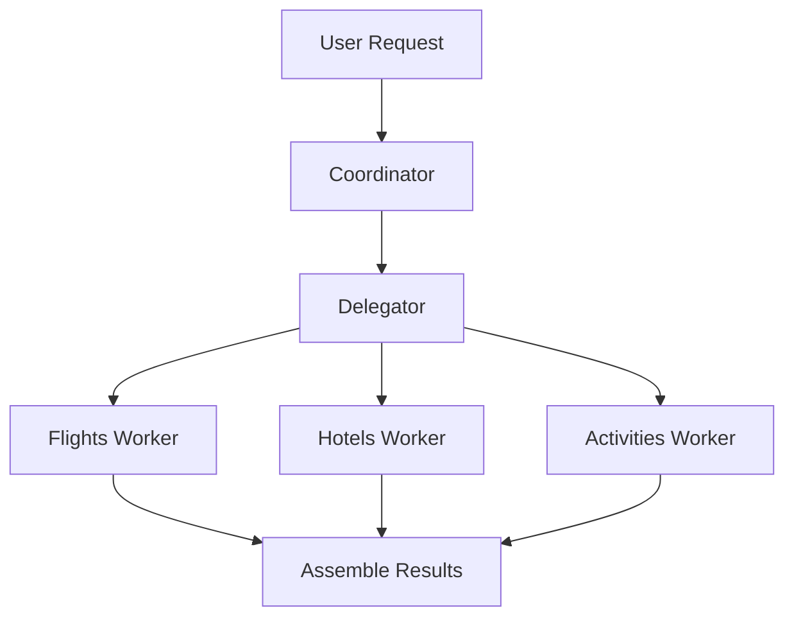

# Lab 6: Nested Agent Graphs

⏱️ **Estimated completion time: 45 minutes**

## Overview

This lab demonstrates the Coordinator/Worker/Delegator (CWD) pattern using LangGraph, modeling a hierarchical organizational structure. It showcases:

- Hierarchical organization in a graph structure
- Parallel execution of specialized worker nodes
- State management across organizational layers
- Advanced patterns with nested subgraphs

## Learning Objectives

By the end of this lab, you will understand:
- How to implement organizational hierarchies in LangGraph
- Coordinator-Worker-Delegator design patterns
- Nested subgraph architectures
- Complex state management across multiple layers

## Prerequisites

- Python 3.8+
- LangGraph installed (`pip install langgraph`)
- Tenacity for retry logic (`pip install tenacity`)

## Key Concepts

### Coordinator/Worker/Delegator Pattern
- **Coordinator**: Creates high-level plans from user requests
- **Delegator**: Distributes work to specialized workers
- **Workers**: Handle specific tasks in parallel
- **Assembly**: Combines results into final output

### Hierarchical Graph Organization
- Multiple layers of decision-making and execution
- Clear separation of concerns between roles
- Scalable architecture for complex workflows

## Lab Code

```python
#!/usr/bin/env python3
"""
Chapter 6 - Coordinator/Worker/Delegator with Nested Graphs
----------------------------------------------------------
This example demonstrates how to implement the Coordinator/Worker/Delegator (CWD)
pattern using LangGraph. It models an organizational hierarchy where:

1. A coordinator creates a high-level plan from a user request
2. A delegator distributes work to specialized workers
3. Workers handle specific tasks in parallel
4. Results are assembled into a final output

Key concepts:
- Hierarchical organization in a graph
- Parallel execution of worker nodes
- State management across organization layers
- Nested subgraphs
"""
import argparse
import json
from typing import Dict, List, TypedDict

from tenacity import retry, stop_after_attempt, wait_fixed
from langgraph.graph import StateGraph

# ---------------------------------------------------------------------------
# Mock external APIs --------------------------------------------------------
# ---------------------------------------------------------------------------

def _mock_flights_api(origin: str, destination: str):
    """Mock flight search API."""
    print(f"Worker: Searching flights from {origin} to {destination}")
    return [
        {"airline": "EconoFly", "price": 350, "duration": "2h 15m"},
        {"airline": "LuxAir", "price": 720, "duration": "1h 55m"},
    ]

def _mock_hotels_api(location: str, max_price: int):
    """Mock hotel search API."""
    print(f"Worker: Finding hotels in {location} under ${max_price}")
    return [
        {"name": "Downtown Inn", "price": 175, "rating": 3.8},
        {"name": "Grand Hotel", "price": 340, "rating": 4.5},
    ]

def _mock_activities_api(location: str, preference: str):
    """Mock activities search API."""
    print(f"Worker: Finding {preference} activities in {location}")
    return [
        {"name": "Guided City Tour", "price": 35, "duration": "3 hours"},
        {"name": "Local Food Experience", "price": 75, "duration": "4 hours"},
    ]

# ---------------------------------------------------------------------------
# API wrappers with retry logic ---------------------------------------------
# ---------------------------------------------------------------------------

@retry(stop=stop_after_attempt(3), wait=wait_fixed(1))
def search_flights(origin: str, destination: str):
    """Wrap flight search with retry logic."""
    return _mock_flights_api(origin, destination)

@retry(stop=stop_after_attempt(3), wait=wait_fixed(1))
def find_hotels(location: str, max_price: int):
    """Wrap hotel search with retry logic."""
    return _mock_hotels_api(location, max_price)

@retry(stop=stop_after_attempt(3), wait=wait_fixed(1))
def find_activities(location: str, preference: str):
    """Wrap activities search with retry logic."""
    return _mock_activities_api(location, preference)

# ---------------------------------------------------------------------------
# State definition ----------------------------------------------------------
# ---------------------------------------------------------------------------
class CWDState(TypedDict, total=False):
    request_text: str              # User's request
    coordinator_plan: Dict         # Plan created by coordinator
    flights: List[Dict]            # Flight options found by worker
    hotels: List[Dict]             # Hotel options found by worker
    activities: List[Dict]         # Activity options found by worker
    complete_itinerary: Dict       # Final assembled result

# ---------------------------------------------------------------------------
# Coordinator node ----------------------------------------------------------
# ---------------------------------------------------------------------------

def coordinator_node(state: CWDState) -> CWDState:
    """
    The coordinator analyzes the user request and creates a high-level plan.
    
    In a real system, this would use an LLM to extract information from natural
    language. For simplicity in this example, we'll use basic text matching.
    """
    request = state["request_text"].lower()
    print("\nCoordinator: Analyzing request and creating plan")
    
    # Extract destination
    destination = None
    if "paris" in request:
        destination = "Paris"
    elif "tokyo" in request:
        destination = "Tokyo"
    elif "new york" in request:
        destination = "New York"
    
    # Extract origin
    origin = None
    if "from london" in request:
        origin = "London"
    elif "from berlin" in request:
        origin = "Berlin"
    elif "from san francisco" in request:
        origin = "San Francisco"
    
    # Set defaults if not found
    if not destination:
        destination = "Paris"  # Default destination
    if not origin:
        origin = "London"  # Default origin
    
    # Determine budget preferences
    max_price_hotel = 400  # Default
    if "luxury" in request:
        max_price_hotel = 800
    elif "budget" in request:
        max_price_hotel = 200
    
    # Determine activity preferences
    preference = "general"  # Default
    if "museum" in request or "culture" in request or "art" in request:
        preference = "cultural"
    elif "food" in request or "cuisine" in request:
        preference = "culinary"
    elif "outdoor" in request or "adventure" in request:
        preference = "outdoor"
    
    # Create the plan
    plan = {
        "origin": origin,
        "destination": destination,
        "max_price_hotel": max_price_hotel,
        "preference": preference
    }
    
    print(f"Coordinator Plan: {json.dumps(plan, indent=2)}")
    
    # Store plan in state
    state["coordinator_plan"] = plan  # type: ignore
    return state

# ---------------------------------------------------------------------------
# Delegator node ------------------------------------------------------------
# ---------------------------------------------------------------------------

def delegator_prepare(state: CWDState) -> CWDState:
    """
    The delegator takes the coordinator's plan and prepares it for workers.
    
    In more complex systems, this would involve breaking down tasks, assigning
    priorities, and managing worker selection.
    """
    plan = state["coordinator_plan"]
    print("\nDelegator: Distributing tasks to specialized workers")
    
    # In this simple example, we just pass through the state
    # A more complex delegator might transform the plan into worker-specific tasks
    
    print(f"  • Assigned flight search: {plan['origin']} → {plan['destination']}")
    print(f"  • Assigned hotel search: {plan['destination']} (max ${plan['max_price_hotel']})")
    print(f"  • Assigned activity search: {plan['preference']} in {plan['destination']}")
    
    return state

# ---------------------------------------------------------------------------
# Worker nodes --------------------------------------------------------------
# ---------------------------------------------------------------------------

def flights_worker(state: CWDState) -> CWDState:
    """Worker responsible for finding flights."""
    plan = state["coordinator_plan"]
    
    # Call the flight search API with parameters from the plan
    flights = search_flights(plan["origin"], plan["destination"])
    
    # Store results in state
    state["flights"] = flights  # type: ignore
    return state


def hotels_worker(state: CWDState) -> CWDState:
    """Worker responsible for finding hotels."""
    plan = state["coordinator_plan"]
    
    # Call the hotel search API with parameters from the plan
    hotels = find_hotels(plan["destination"], plan["max_price_hotel"])
    
    # Store results in state
    state["hotels"] = hotels  # type: ignore
    return state


def activities_worker(state: CWDState) -> CWDState:
    """Worker responsible for finding activities."""
    plan = state["coordinator_plan"]
    
    # Call the activities search API with parameters from the plan
    activities = find_activities(plan["destination"], plan["preference"])
    
    # Store results in state
    state["activities"] = activities  # type: ignore
    return state

# ---------------------------------------------------------------------------
# Result assembly -----------------------------------------------------------
# ---------------------------------------------------------------------------

def assemble_itinerary(state: CWDState) -> CWDState:
    """
    Combine all worker results into a complete itinerary.
    
    This represents the final integration of all parallel work streams.
    """
    plan = state["coordinator_plan"]
    print("\nAssembling final itinerary from worker results")
    
    # For this demo, we'll choose the cheapest flight, highest rated hotel,
    # and include all activities
    
    # Select cheapest flight
    flights = state.get("flights", [])
    selected_flight = min(flights, key=lambda f: f["price"]) if flights else None
    
    # Select highest rated hotel
    hotels = state.get("hotels", [])
    selected_hotel = max(hotels, key=lambda h: h["rating"]) if hotels else None
    
    # Include all activities found
    activities = state.get("activities", [])
    
    # Create the complete itinerary
    state["complete_itinerary"] = {
        "destination": plan.get("destination"),
        "origin": plan.get("origin"),
        "flight": selected_flight,
        "hotel": selected_hotel,
        "activities": activities,
    }
    
    return state

# ---------------------------------------------------------------------------
# Graph construction --------------------------------------------------------
# ---------------------------------------------------------------------------

def build_cwd_graph() -> StateGraph:
    """Build the graph representing CWD organizational structure."""
    g = StateGraph(CWDState)
    
    # Add the coordinator node as entry point
    g.add_node("coordinator", coordinator_node)
    g.set_entry_point("coordinator")
    
    # Add delegator node
    g.add_node("delegator", delegator_prepare)
    g.add_edge("coordinator", "delegator")
    
    # Add worker nodes
    g.add_node("flights", flights_worker)
    g.add_node("hotels", hotels_worker)
    g.add_node("activities", activities_worker)
    
    # Connect delegator to all workers
    for worker in ("flights", "hotels", "activities"):
        g.add_edge("delegator", worker)
    
    # Connect all workers to assembly
    g.add_node("assemble", assemble_itinerary)
    for worker in ("flights", "hotels", "activities"):
        g.add_edge(worker, "assemble")
    
    # Set assembly as finish point
    g.set_finish_point("assemble")
    
    return g

# ---------------------------------------------------------------------------
# Advanced nested subgraphs example -----------------------------------------
# ---------------------------------------------------------------------------

def create_nested_subgraph_example():
    """
    Example of using nested subgraphs for even more complex organization.
    
    This function is not called in the main demo but illustrates how
    subgraphs can be nested for complex hierarchies.
    """
    # This is a conceptual example showing how nested graphs would work
    # but not executed in the main flow
    
    # Main graph representing the entire organization
    main_graph = StateGraph(Dict)
    
    # Create strategy team subgraph
    strategy_team = StateGraph(Dict)
    strategy_team.add_node("analyze", lambda s: s)
    strategy_team.add_node("plan", lambda s: s)
    strategy_team.add_edge("analyze", "plan")
    strategy_team.set_entry_point("analyze")
    strategy_team.set_finish_point("plan")
    
    # Create operations team subgraph
    operations_team = StateGraph(Dict)
    operations_team.add_node("logistics", lambda s: s)
    operations_team.add_node("execution", lambda s: s)
    operations_team.add_edge("logistics", "execution")
    operations_team.set_entry_point("logistics")
    operations_team.set_finish_point("execution")
    
    # Add team subgraphs to main graph
    main_graph.add_node("strategy", strategy_team.compile())
    main_graph.add_node("operations", operations_team.compile())
    main_graph.add_edge("strategy", "operations")
    
    # This pattern mirrors real organizational charts
    return main_graph

# ---------------------------------------------------------------------------
# Main function -------------------------------------------------------------
# ---------------------------------------------------------------------------

def main():
    # Parse command-line arguments
    parser = argparse.ArgumentParser(description="Coordinator-Worker-Delegator Demo")
    parser.add_argument("--request", type=str, 
                      default="I want to travel from London to Paris, stay in a nice hotel, and enjoy some cultural activities.",
                      help="User request text")
    args = parser.parse_args()

    # Print header
    print("\n=== Coordinator-Worker-Delegator Pattern Demo ===\n")
    print(f"User Request: \"{args.request}\"")
    
    # Build the CWD graph
    graph = build_cwd_graph().compile()
    
    # Create initial state with user request
    initial_state: CWDState = {"request_text": args.request}
    
    # Execute the graph with organizational workflow
    final_state = graph.invoke(initial_state)
    
    # Display the results
    print("\n=== Final Travel Package ===\n")
    itinerary = final_state["complete_itinerary"]
    
    print(f"Trip from {itinerary['origin']} to {itinerary['destination']}")
    
    # Flight information
    flight = itinerary.get("flight", {})
    if flight:
        print(f"\nFlight: {flight['airline']}")
        print(f"  Price: ${flight['price']}")
        print(f"  Duration: {flight['duration']}")
    
    # Hotel information
    hotel = itinerary.get("hotel", {})
    if hotel:
        print(f"\nHotel: {hotel['name']}")
        print(f"  Price: ${hotel['price']} per night")
        print(f"  Rating: {hotel['rating']}/5.0")
    
    # Activities
    print("\nRecommended Activities:")
    for idx, activity in enumerate(itinerary.get("activities", [])):
        print(f"  {idx+1}. {activity['name']}")
        print(f"     ${activity['price']} - {activity['duration']}")

if __name__ == "__main__":
    main() 
```

## How to Run

1. Save the code above as `06_nested_graphs.py`
2. Install dependencies: `pip install langgraph tenacity`
3. Run the script: `python 06_nested_graphs.py`
4. Try with custom requests: `python 06_nested_graphs.py --request "I want a luxury trip from Berlin to Tokyo with outdoor activities"`

## Expected Output

```
=== Coordinator-Worker-Delegator Pattern Demo ===

User Request: "I want to travel from London to Paris, stay in a nice hotel, and enjoy some cultural activities."

Coordinator: Analyzing request and creating plan
Coordinator Plan: {
  "origin": "London",
  "destination": "Paris",
  "max_price_hotel": 400,
  "preference": "cultural"
}

Delegator: Distributing tasks to specialized workers
  • Assigned flight search: London → Paris
  • Assigned hotel search: Paris (max $400)
  • Assigned activity search: cultural in Paris

Worker: Searching flights from London to Paris
Worker: Finding hotels in Paris under $400
Worker: Finding cultural activities in Paris

Assembling final itinerary from worker results

=== Final Travel Package ===

Trip from London to Paris

Flight: EconoFly
  Price: $350
  Duration: 2h 15m

Hotel: Grand Hotel
  Price: $340 per night
  Rating: 4.5/5.0

Recommended Activities:
  1. Guided City Tour
     $35 - 3 hours
  2. Local Food Experience
     $75 - 4 hours
```

## Key Concepts Explained

### Organizational Hierarchy
- **Coordinator**: Strategic planning and requirement analysis
- **Delegator**: Task distribution and worker management
- **Workers**: Specialized execution units
- **Assembly**: Result integration and synthesis

### Graph Architecture



### State Flow Management
- State flows through hierarchical layers
- Each layer adds its contribution to the state
- Workers operate in parallel on shared state
- Assembly combines all worker outputs

### Natural Language Processing
- Coordinator extracts structured data from natural language
- Simple keyword matching in this demo
- Real implementations would use LLMs for understanding

## Advanced Patterns

### Nested Subgraphs
```python
def create_complex_organization():
    """Example of deeply nested organizational structure."""
    main_graph = StateGraph(Dict)
    
    # Department-level subgraphs
    marketing_dept = create_marketing_subgraph()
    engineering_dept = create_engineering_subgraph()
    
    # Team-level subgraphs within departments
    frontend_team = create_frontend_subgraph()
    backend_team = create_backend_subgraph()
    
    # Nest teams within departments
    engineering_dept.add_node("frontend", frontend_team.compile())
    engineering_dept.add_node("backend", backend_team.compile())
    
    return main_graph
```

### Dynamic Worker Assignment
```python
def smart_delegator(state: CWDState) -> CWDState:
    """Intelligently assign tasks based on worker capabilities and load."""
    available_workers = get_available_workers()
    task_complexity = analyze_task_complexity(state["coordinator_plan"])
    
    # Select best workers for each task
    for task in state["tasks"]:
        best_worker = select_optimal_worker(task, available_workers)
        assign_task(task, best_worker)
    
    return state
```

### Error Handling and Recovery
```python
def resilient_worker(state: CWDState) -> CWDState:
    """Worker with fallback strategies and error recovery."""
    try:
        return primary_work_function(state)
    except PrimaryServiceError:
        return fallback_work_function(state)
    except Exception as e:
        return error_recovery_function(state, e)
```

## Exercises

1. **Add more worker types**: Implement workers for weather, transportation, or currency exchange
2. **Intelligent delegation**: Create a smarter delegator that assigns tasks based on worker availability and expertise
3. **Nested hierarchies**: Implement deeper organizational structures with teams within departments
4. **Dynamic scaling**: Add the ability to spawn additional workers based on workload
5. **Monitoring and metrics**: Track worker performance and success rates

## Real-World Applications

- **Enterprise Workflow Management**: Model complex business processes
- **Microservices Orchestration**: Coordinate distributed service calls
- **Data Pipeline Management**: Orchestrate ETL processes with multiple stages
- **DevOps Automation**: Coordinate deployment across multiple environments
- **Customer Service**: Route requests through specialized support teams

## Performance Considerations

- **Parallel Execution**: Workers operate simultaneously for better throughput
- **Resource Management**: Each worker can be optimized for its specific task
- **Fault Tolerance**: Individual worker failures don't bring down the entire system
- **Scalability**: Easy to add new workers or scale existing ones

## Download Code

[Download 06_nested_graphs.py](06_nested_graphs.py){ .md-button .md-button--primary } 