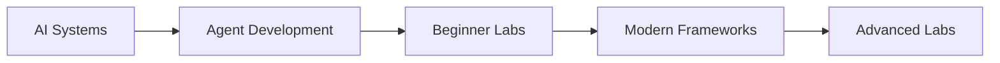
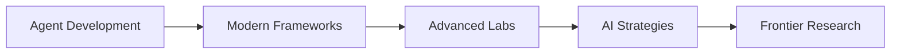
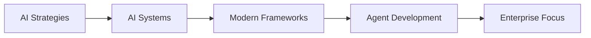
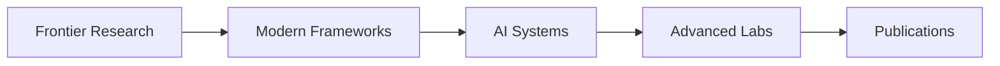

# Course Overview & Navigation

A comprehensive guide to all available courses and learning paths in the Agentic AI Systems curriculum.

## 📚 All Courses at a Glance

### 🧠 AI Systems (Foundation Track)
**Master the theoretical foundations**

- **Duration**: 11 chapters  
- **Level**: Beginner to Intermediate
- **Focus**: Theory, concepts, and principles
- **Prerequisites**: Basic AI/ML knowledge

Key topics: Generative AI fundamentals, agentic principles, cognitive architectures, multi-agent systems, ethics

[Start Course →](AI_Systems/index.md){ .md-button .md-button--primary }

---

### ⚡ Agent Development (Implementation Track)  
**Build production-ready AI agents**

- **Duration**: 10 chapters
- **Level**: Intermediate to Advanced  
- **Focus**: Hands-on coding and implementation
- **Prerequisites**: Python programming, basic AI concepts

Key topics: LangChain, LangGraph, DSPy, debugging, deployment, state management

[Start Course →](Agentic_AI_in_Action/index.md){ .md-button .md-button--primary }

---

### 🚀 Modern AI Frameworks (Cutting-Edge Track)
**Explore the latest technologies**

- **Duration**: 8 chapters
- **Level**: Intermediate to Advanced
- **Focus**: Latest frameworks and tools (2024-2025)
- **Prerequisites**: Agent development experience

Key topics: Pydantic AI, MCP, autonomous agents, OpenAI Swarm, enterprise platforms

[Start Course →](Modern_AI_Frameworks/index.md){ .md-button .md-button--primary }

---

### 📈 AI Strategies (Leadership Track)
**Lead AI transformation**

- **Duration**: 17 chapters
- **Level**: Advanced
- **Focus**: Strategic planning and organizational change
- **Prerequisites**: Business/technical leadership experience

Key topics: Strategic planning, team building, change management, ROI measurement, governance

[Start Course →](AI_Strategies/index.md){ .md-button .md-button--primary }

## 🎯 Recommended Learning Paths

### Path 1: Complete Beginner

1. **[AI Systems](AI_Systems/index.md)** - Build theoretical foundation
2. **[Agent Development](Agentic_AI_in_Action/index.md)** - Learn practical implementation
3. **[Beginner Labs](Labs/README.md)** - Practice with guided exercises  
4. **[Modern Frameworks](Modern_AI_Frameworks/index.md)** - Explore latest tools
5. **[Advanced Labs](Labs/README.md)** - Build complex systems

### Path 2: Experienced Developer

1. **[Agent Development](Agentic_AI_in_Action/index.md)** - Jump into coding
2. **[Modern Frameworks](Modern_AI_Frameworks/index.md)** - Master cutting-edge tools
3. **[Advanced Labs](Labs/README.md)** - Build sophisticated systems
4. **[AI Strategies](AI_Strategies/index.md)** - Scale to production
5. **[Frontier Research](Frontier_Research/index.md)** - Explore future directions

### Path 3: Technical Leader

1. **[AI Strategies](AI_Strategies/index.md)** - Strategic understanding
2. **[AI Systems](AI_Systems/index.md)** - Technical foundations
3. **[Modern Frameworks](Modern_AI_Frameworks/index.md)** - Technology landscape
4. **[Agent Development](Agentic_AI_in_Action/index.md)** - Implementation knowledge
5. **Enterprise Platforms** - Production deployment

### Path 4: Researcher/Academic

1. **[Frontier Research](Frontier_Research/index.md)** - Latest developments
2. **[Modern Frameworks](Modern_AI_Frameworks/index.md)** - Cutting-edge tools
3. **[AI Systems](AI_Systems/index.md)** - Theoretical depth
4. **[Advanced Labs](Labs/README.md)** - Research implementations
5. **Research Projects** - Original contributions

## 🔍 Find Content by Topic

### Core Technologies
- **[LangChain & LangGraph](Agentic_AI_in_Action/index.md)** - Traditional agent frameworks
- **[Pydantic AI](Modern_AI_Frameworks/pydantic_ai.md)** - Type-safe agent development
- **[OpenAI Swarm](Modern_AI_Frameworks/orchestration.md)** - Lightweight multi-agent coordination
- **[Model Context Protocol](Modern_AI_Frameworks/mcp.md)** - Standardized tool integration

### Advanced Concepts  
- **[Multi-Agent Systems](AI_Systems/6.md)** - Coordination and collaboration
- **[Reflection & Metacognition](AI_Systems/4.md)** - Self-improving agents
- **[Tool Use & Planning](AI_Systems/5.md)** - External tool integration
- **[Autonomous Agents](Modern_AI_Frameworks/autonomous_agents.md)** - Self-directed systems

### Implementation Focus
- **[State Management](Agentic_AI_in_Action/6.md)** - Memory and persistence
- **[Debugging & Monitoring](Agentic_AI_in_Action/7.md)** - Development tools
- **[Fine-tuning](Labs/11_agent_finetuning.md)** - Model optimization
- **[RAG Systems](Labs/13_document_rag_agents.md)** - Document processing

### Strategic Topics
- **[Technology Selection](AI_Strategies/3.md)** - Choosing the right tools
- **[Team Building](AI_Strategies/2.md)** - Organizing AI teams
- **[Change Management](AI_Strategies/5.md)** - Organizational transformation
- **[ROI Measurement](AI_Strategies/15.md)** - Business value assessment

## 📊 Course Statistics

| Course | Chapters | Labs | Difficulty | Est. Time |
|--------|----------|------|------------|-----------|
| AI Systems | 11 | 0 | Beginner | 15-20 hours |
| Agent Development | 10 | 13 | Intermediate | 25-30 hours |  
| Modern Frameworks | 8 | 0 | Advanced | 12-15 hours |
| AI Strategies | 17 | 0 | Advanced | 20-25 hours |
| **Total** | **46** | **13** | - | **70-90 hours** |

## 🚀 Getting Started

1. **Assess Your Background**: Choose a learning path based on your experience level
2. **Set Learning Goals**: Decide whether you want theoretical knowledge, practical skills, or strategic understanding
3. **Use Navigation Tools**: Leverage the horizontal tabs, search, and tags for easy content discovery
4. **Track Progress**: The system automatically tracks your progress across all courses
5. **Practice Regularly**: Use the labs to reinforce theoretical concepts

## 💡 Study Tips

- **Start with foundations** if you're new to AI agents
- **Jump to implementation** if you have AI/ML background
- **Focus on strategy** if you're in a leadership role
- **Explore research** if you're working on cutting-edge projects
- **Use keyboard shortcuts** (Press `?` for help)
- **Bookmark important pages** for quick reference

---

*Ready to begin? Choose your learning path and start your journey into agentic AI systems!*
