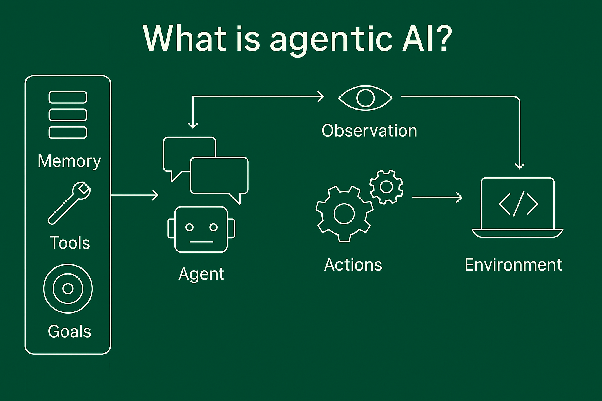
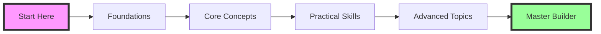

# Welcome to Agentic AI Systems 🚀

### **Master the Art of Building Intelligent AI Agents**

---

## 🎯 What You'll Learn

!!! info "Transform Your AI Skills"
    This comprehensive course takes you from foundational concepts to advanced implementation of agentic AI systems. Whether you're a developer, researcher, or technology leader, you'll gain the skills to design, build, and deploy sophisticated AI agents.

- :material-brain: **Deep Understanding**  
  Master the theoretical foundations and cognitive architectures that power modern AI agents

- :material-code-braces: **Hands-On Development**  
  Build real-world agents using cutting-edge frameworks like LangChain and LangGraph

- :material-strategy: **Strategic Implementation**  
  Learn to lead AI initiatives and drive organizational transformation

- :material-shield-check: **Ethical AI Design**  
  Develop responsible AI systems with built-in safety and transparency

---

## 📚 Course Tracks

### [:material-school: **AI Systems**](AI_Systems/1.md){ .md-button .md-button--primary }

**Foundation Track** · 11 Chapters

Dive deep into the theoretical underpinnings of agentic systems:

- 🧠 Generative AI fundamentals
- 🏗️ Agent architectures and components  
- 🔄 Reflection and introspection mechanisms
- 🛠️ Tool use and planning strategies
- 👥 Multi-agent coordination
- 🛡️ Safety and ethical considerations

---

### [:material-rocket-launch: **Agent Development**](Agentic_AI_in_Action/1.md){ .md-button .md-button--primary }

**Implementation Track** · 9 Chapters

Master practical agent development with modern tools:

- 🔗 LangChain for agent foundations
- 📊 LangGraph for complex orchestration
- ⚡ DSPy for optimization
- 💾 State management and persistence
- 🔍 Debugging with LangSmith
- 🚀 Production deployment strategies

---

### [:material-chess-king: **AI Strategies**](AI_Strategies/1.md){ .md-button .md-button--primary }

**Leadership Track** · 17 Chapters

Lead successful AI transformation:

- 👔 Chief AI Officer responsibilities
- 🎯 Crafting winning AI strategies
- 👥 Building high-performing teams
- 📈 Managing AI projects
- 💡 Innovation and change management
- 🏢 Enterprise AI governance

---

## 🎓 Who Should Take This Course?

:material-developer-board: **Developers & Engineers**
: Learn to build production-ready AI agents with modern frameworks

:material-microscope: **Researchers & Data Scientists**  
: Understand advanced architectures and push the boundaries of AI

:material-briefcase: **Technology Leaders**
: Master strategic AI implementation and organizational transformation

:material-school-outline: **Students & Educators**
: Gain comprehensive knowledge of cutting-edge AI systems

---

## 🚀 Getting Started

!!! tip "Recommended Learning Path"
    
    1. **Start with Theory** → Begin with [AI Systems](AI_Systems/1.md) to build a solid foundation
    2. **Apply in Practice** → Move to [Agent Development](Agentic_AI_in_Action/1.md) for hands-on experience  
    3. **Lead with Strategy** → Explore [AI Strategies](AI_Strategies/1.md) for organizational impact

    Each track is designed to be self-contained, so you can also jump directly to your area of interest!

---

## 💡 Course Highlights

- :material-file-document-multiple: **35+ Comprehensive Chapters**
- :material-code-tags: **Practical Code Examples**  
- :material-tools: **Real-World Projects**
- :material-certificate: **Industry-Relevant Skills**
- :material-update: **Continuously Updated Content**
- :material-account-group: **Active Learning Community**

---

## 🛠️ Technologies Covered

| Framework | Purpose | Track |
|-----------|---------|-------|
| **LangChain** | Agent Foundation Framework | Development |
| **LangGraph** | State Management & Orchestration | Development |
| **DSPy** | Prompt Optimization | Development |
| **LangSmith** | Debugging & Monitoring | Development |
| **OpenAI/Anthropic** | LLM Providers | All Tracks |
| **Vector Databases** | Knowledge Storage | Systems & Development |

---

## 📈 Your Learning Journey

---

### **Ready to Master Agentic AI?**

[Start Learning Now](AI_Systems/1.md){ .md-button .md-button--primary .md-button--large }

---

!!! quote "Join the AI Revolution"
    *"The future belongs to those who understand how to create, orchestrate, and deploy intelligent agents. This course is your gateway to that future."*

---

<small>Built with ❤️ for the AI community</small>

 